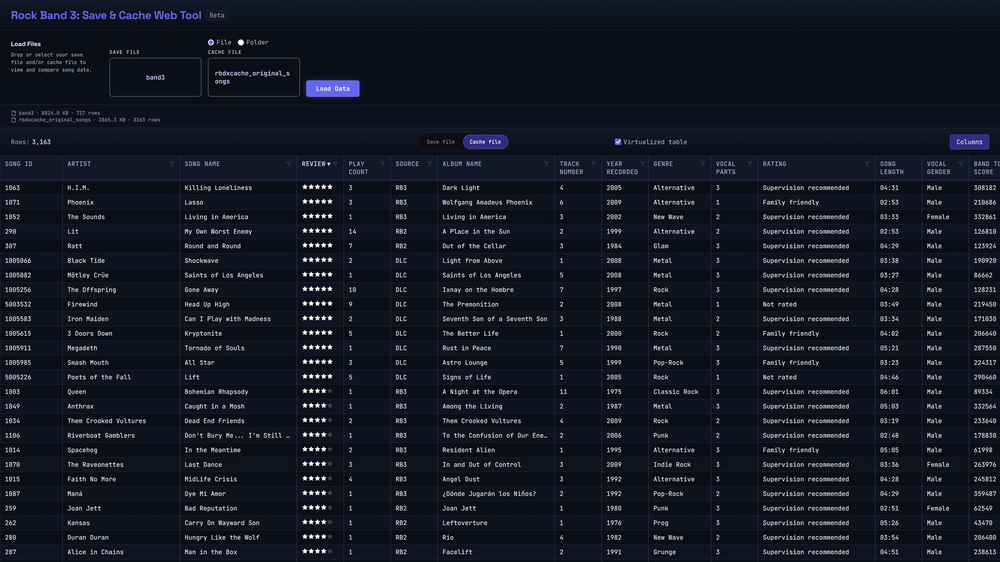

# Rock Band - Save & Cache web tool

## Purpose

Allows the user to read their save and cache files from Rock Band 3 and display them in a table format.

## Requirements

- A browser, but no network connection is required. I do plan to add an option to find the song on YouTube, Spotify, etc. at some point, but the core functionality won't need to connect to any server.
  - Firefox and Chrome tested but should work with most modern versions of browsers.

## Systems and files supported

- Xbox 360
  - Extracted save.dat
  - Extracted songcache or rbdxcache
  - Extraction can be done by dragging and dropping the file into Nautilus. The extraction functionality (STFS) for this app is still a WIP

- Wii
  - band3.dat
  - MSTORE.vff

- PS3
  - SAVE.DAT

The files I have tested are from specific versions of the game. There might be subtle differences with older versions that could make them unreadable. Contact me if you run into an issue and I can try to add support for them.

PS3 does not produce a cache file, but I'm planning to add support for a folder selector. It would go through a folder and all its subfolders to read the songs.dta file and get similar data into the table.

## Usage

Download the latest **rb-save-cache-web-tool.html** from releases and open it with the browser of your choice, either by double-clicking the file or dragging and dropping it into the browser.

If given both files, their data will be combined into a single row by song ID. The user can also provide just one of the files and its data will be shown.

Data available in [save file](./src/types/file/SongRowSave.ts).

Data available in [cache file](./src/types/file/SongRowCache.ts).

When a cache file is provided, the Rock Band 3 on-disc songs are also read from a separate .dta file, since they are not included in the cache files.

Columns can be

- Sorted with a single click of the header. Only one column can be sorted at a time: the first click sorts ascending, the second click sorts descending, and the third click removes sorting and restores the original order from the file.
- Filtered with a small icon towards the right side of the column. Multiple filters can be enabled at the same time. There are a few different types of filters, like:
  - Starting with a letter for Artist and Song name.
  - All possible values listed for example with review
  - List all with a value or all without a value with for example highscore columns.
- Resized from a drag handle toward the right edge of the column.
- Hidden or shown depending on what interests the user. This can be controlled from a separate window which can be opened with the **Columns** button above the table.

## Modes

### Primary file

If both are given, they can be viewed from either file's perspective, and only the songs from that file are listed.
This is controlled by the sliding button in the middle above the table.

For example, a save file might have a score for a song that has been removed or had its ID changed in a recharting. This will most likely appear as the row not having a song name or artist, since the save file doesn't contain that information and there is no longer a matching ID in the cache file.

The cache file should contain all songs the game has read and recognized when it was last generated. Unless you have played them all, it will most likely contain more songs than the save file.

### Table mode

This is controlled by a small check box between the primary file selector and column visibility selector.

#### Virtualized (default)

Only renders just beyond the viewport, which greatly increases performance for all functionalities like sorting, resizing columns, and toggling column visibility.
Only downside is that native search of browsers will only target the rendered data and not out of view data.
A custom search functionality for columns or the whole table could be implemented to mitigate this problem.

#### Un-virtualized

Renders everything, which has caused slow performance when the row count is in the thousands and every column is visible. I tried to improve performance by removing most of the functionalities present in the Virtualized version. There are of course more things that could be done, like paging, that would reduce the workload. I will keep this version available for now to get feedback on how important the search functionality is.

## Credits

This app would not be possible without the groundwork, tools, and assistance of many others.

Credit where credit is due:

- **trojannemo** — Nautilus with cache file logic, dta parsing and stfs-file extracting.  
  https://github.com/trojannemo/Nautilus

- **StackOverflow0x** — Save Scores Viewer with logic to decrypt the Rock Band 3 save file contents.
